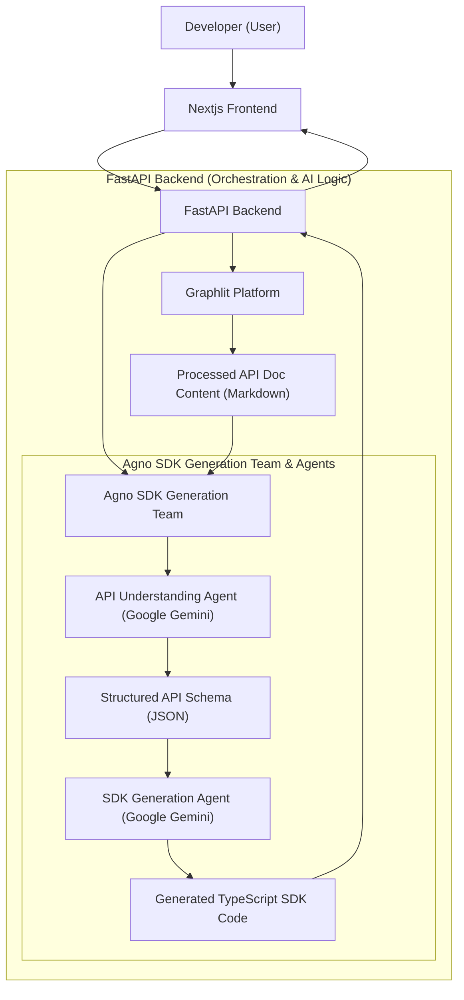
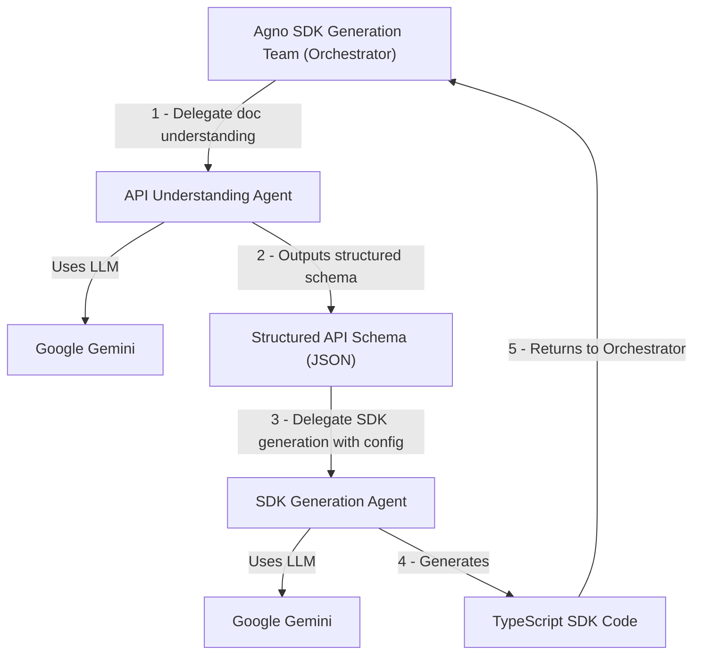

# Type-Scribe AI: Agentic TypeScript SDK Generator 🤖✨


Welcome to **Type-Scribe AI**! This project showcases an intelligent agent system designed to automate the creation of TypeScript API SDKs directly from existing API documentation (such as READMEs or website docs). Our aim is to significantly reduce the manual effort and potential for errors developers face when integrating with new APIs, providing a streamlined and rapid SDK generation process.

This repository (`type-scribe-ai-submission`) contains the complete codebase for the Type-Scribe AI project, organized into `frontend` and `backend` sub-folders.

## Table of Contents

- [Overview of the Idea 💡](#overview-of-the-idea-💡)
- [Project Goal 🎯](#project-goal-🎯)
- [How It Works ⚙️](#how-it-works-⚙️)
  - [User Flow 🚶‍♂️](#user-flow-🚶‍♂️)
  - [Core Functionality 🛠️](#core-functionality-🛠️)
  - [Multimodal Elements ✍️](#multimodal-elements-✍️)
- [Tools Used 🧰](#tools-used-🧰)
- [UI Approach 🖥️](#ui-approach-🖥️)
- [Visuals 📊](#visuals-📊)
  - [Project Architecture 🗺️](#project-architecture-🗺️)
  - [Agno Team & Agent Workflow 🤝](#agno-team--agent-workflow-🤝)
- [Project Structure 📁](#project-structure-📁)
- [Getting Started (Setup & Run Instructions) 🚀](#getting-started-setup--run-instructions-🚀)
  - [Prerequisites ✅](#prerequisites-✅)
  - [Backend Setup 🐍](#backend-setup-🐍)
  - [Frontend Setup ⚛️](#frontend-setup-⚛️)
- [Team Information 🧑‍💻](#team-information-🧑‍💻)
- [Prize Category Selection 🏆](#prize-category-selection-🏆)
- [Demo Video Link ▶️](#demo-video-link-▶️)
- [Additional Notes 📝](#additional-notes-📝)


## Overview of the Idea 💡

Type-Scribe AI is an intelligent agent system designed to automate the creation of TypeScript API SDKs directly from existing API documentation (such as READMEs or website docs). This project aims to significantly reduce the manual effort and potential for errors developers face when integrating with new APIs, providing a streamlined and rapid SDK generation process.

## Project Goal 🎯

To demonstrate a functional AI agent system that can intelligently:
1.  Ingest unstructured API documentation.
2.  Parse and understand API endpoints, request/response structures, and data types.
3.  Orchestrate multiple agents to generate a basic, usable TypeScript SDK.

The project emphasizes practical application of multi-agent orchestration and advanced LLM capabilities to solve a common developer pain point.

## How It Works ⚙️

The system is built around a multi-agent architecture orchestrated by Agno, with a user-friendly frontend and robust backend.

### User Flow 🚶‍♂️
1.  The user visits the Next.js frontend and provides a URL or uploads a README file containing the API documentation.
2.  The user fills out a brief form with basic details for the SDK (e.g., SDK name, version, base URL).
3.  The user initiates the SDK generation process.
4.  The frontend displays progress and, upon completion, allows the user to download the generated TypeScript SDK.

### Core Functionality 🛠️
1.  **Documentation Ingestion**: A dedicated agent (working with `Graphlit`) scrapes or reads the provided API documentation, converting it into a structured format.
2.  **API Understanding Agent**: A Google Gemini-powered agent, guided by Agno, analyzes the ingested documentation, identifying API endpoints, methods (GET, POST, etc.), parameters, request/response schemas, and data types.
3.  **SDK Generation Agent**: Another agent, also leveraging Gemini's code generation capabilities and Agno's orchestration, translates the understood API schema into well-structured TypeScript code for the SDK, including type definitions, helper functions, and client methods.
4.  **Orchestration**: Agno intelligently manages the flow between these agents, ensuring proper sequencing, error handling, and robust data transfer to build the SDK piece by piece.
5.  **Backend Logic**: A Python FastAPI backend serves as the bridge between the frontend and the Agno-orchestrated agent system, managing API requests and responses.

### Multimodal Elements ✍️
*   **Text**: Primary mode, involving ingestion of text-based API documentation and generation of TypeScript code (text).

## Tools Used 🧰

*   **Agent Orchestration**: [Agno](https://github.com/agno-agi/agno)
*   **Large Language Model (LLM)**: Google Gemini (via `google-generative-ai`)
*   **Documentation Ingestion**: [Graphlit](https://www.graphlit.com/)
*   **Frontend**: Next.js
*   **Backend**: Python FastAPI
*   **Programming Languages**: TypeScript (for generated SDK), Python (for backend/agents), TypeScript (for frontend)

## UI Approach 🖥️

The user interface is a straightforward, single-page web application built with Next.js. It features:
*   A form to input the API documentation source (URL or file upload).
*   Fields for basic SDK configuration details.
*   A progress indicator during SDK generation.
*   A display area for the generated code and a download button for the SDK package.

## Visuals 📊

### Project Architecture 🗺️

This diagram illustrates the overall system architecture, showing how the frontend interacts with the FastAPI backend, and how the backend orchestrates the AI agents and integrates with external services.



### Agno Team & Agent Workflow 🤝
This diagram details the internal workflow and collaboration between the Agno-orchestrated agents within the FastAPI backend, from raw documentation processing to final SDK code generation.



## Project Structure 📁
This submission contains two main components, each in its own sub-folder:

*   `backend/`: Contains the Python FastAPI application that orchestrates the AI agents and handles API requests. For detailed setup and running instructions, refer to its dedicated `backend/README.md`.
*   `frontend/`: Contains the Next.js application that provides the user interface for Type-Scribe AI. For detailed setup and running instructions, refer to its dedicated `frontend/README.md`.

Each sub-folder has its own detailed `README.md` with specific setup, running, and project structure information.

## Getting Started (Setup & Run Instructions) 🚀
To get Type-Scribe AI up and running, you'll need to set up both the backend and frontend components.

### Prerequisites ✅
*   Python 3.9+ (for backend)
*   Node.js 18+ (for frontend)
*   npm or Yarn or pnpm or bun (for frontend)
*   API Keys:
    *   Graphlit API Credentials: `GRAPHLIT_ORGANIZATION_ID`, `GRAPHLIT_ENVIRONMENT_ID`, `GRAPHLIT_JWT_SECRET` (from Graphlit Developer Portal)
    *   Google Gemini API Key: `GOOGLE_API_KEY` (from Google AI Studio or Google Cloud Console)

### Backend Setup 🐍
1.  Navigate to the `backend` directory:
    ```bash
    cd backend
    ```
2.  Follow detailed instructions:
    Refer to the `backend/README.md` file located at `backend/README.md` for comprehensive step-by-step guidance on setting up the Python virtual environment, installing dependencies, configuring environment variables (`.env` file), and running the FastAPI server.

❗ **Important**: It is crucial to have the backend server running before starting the frontend.

### Frontend Setup ⚛️
1.  Open a new terminal and navigate to the `frontend` directory:
    ```bash
    cd frontend
    ```
2.  Follow detailed instructions:
    Refer to the `frontend/README.md` file located at `frontend/README.md` for comprehensive step-by-step guidance on installing Node.js dependencies, configuring environment variables (`.env.local` file to point to your running backend), and starting the Next.js development server.

Once both components are successfully set up and running, open your web browser and navigate to `http://localhost:3000` (or the port your frontend is configured to run on) to interact with Type-Scribe AI.

## Team Information 🧑‍💻
*   **Team Lead**: 808vita (GitHub: https://github.com/808vita)
*   **Team Members**: Solo Developer
*   **Background/Experience**: Full Stack JavaScript (NextJS, MERN) and Python (Fastapi), cat memes enjoyer

## Prize Category Selection 🏆
As per hackathon rules, these fields are for judges to assign.

*   [ ] Best use of Agno
*   [ ] Best use of Graphlit
*   [ ] Best Overall Project
*   [ ] Best use of Firecrawl
*   [ ] Best use of Mem0
*   [ ] Best use of Browser Use
*   [ ] Best use of Potpie

## Demo Video Link ▶️
To be added (2-3 minute demo video)

## Additional Notes 📝
This project aims to showcase the power of AI agents in automating complex developer workflows, offering significant value to the developer community. We believe Type-Scribe AI provides a practical solution to a common development challenge, leveraging the strengths of multi-agent orchestration with Agno and the capabilities of Google Gemini and Graphlit.
